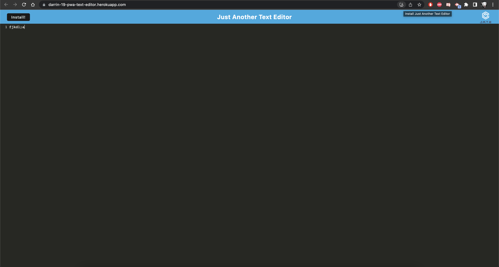

# pwa-text-editor

Description: This is a text editor that runs in the browser, but the app is also a single-page application that meets the PWA criteria. Additionally, it features number of data persistence techniques that serve as redundancy in case one of the options is not supported by the browser. The application will also function offline.

Deployed App: https://darrin-19-pwa-text-editor.herokuapp.com/

Screenshot: 

